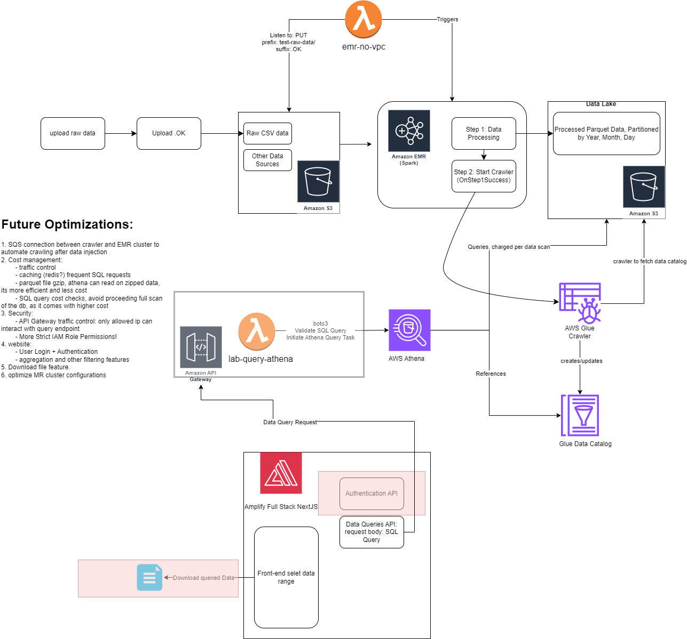

https://docs.google.com/document/d/129XCwxpDuanK8i2NmHq00VVBzfDTSufX_fPHh8Laxis/edit#heading=h.82tnjwl94wdi

# Data Engineering Project - Data Pipeline + Data Sharing Platform

## Project Description
This project aims to design a data pipeline and a data sharing platform for a medical data sharing platform. The platform receives monthly data from hospitals in .csv format, which contains structured data of medical test results. The data size is > 500TB, and new data comes in monthly. The platform needs to support queries for data filtering and aggregation.

## Software Architecture

## Solution Analysis
1. monthly new data comes in, which is stored in S3 bucket
2. EMR cluster is triggered by an event to process the data, initiates 2 steps:
    - Step 1: ETL job to process the data and store it in S3 bucket in parquet format
    - Step 2: Crawler to crawl the new data and update the schema in Glue Data Catalog (metadata used by Athena for SQL queries on S3 patitioned parquet data)
3. Athena is used to query the data (Parquet) in S3 bucket, theres two options:
    - Athena query engine: for ad-hoc queries
    - API Gateway + Lambda: for predefined queries
4. AWS QuickSight service can be used to visualize the data and get data insights. Works on top of Athena.
5. front-end website to interact with the data, using API Gateway + Lambda to query the data.
6. Designed a few tricks for consistency and atuomation.

## Cost Management Strategy
1. traffic control
2. caching (redis?) frequent SQL requests
3. parquet file gzip/snappy, its more efficient in storage and querying
    - gzip: 1.5x compression, snappy: 2x compression
    - query gzip is slightly slower than snappy, choose compression method wisely based on the use case
4. Athen:
    - ANSI SQL query cost checks, 
    - avoid proceeding full scan of the db, as it comes with higher cost
    - use partitioning in S3 bucket, to reduce the amount of data scanned
5. Transient Elastic MapReduce Cluster - Triggered by specific events with termination after job completion
6. Pay per use services: Athena, API Gateway, Lambda are prioritized in this system.

## Adaptability
1. The system is designed to be scalable, as the data size is > 500TB and new data comes in monthly.
2. The system is designed to be cost-effective, with pay-per-use services prioritized.
3. The system is designed to be secure, with strict IAM Role Permissions and API Gateway traffic control.
4. The system is designed to be user-friendly, with a front-end website for data interaction.
5. Automation among the services, less maintainance and human intervention required.
6. Any part of the system can be moved to local servers or other cloud providers with minimal changes.
7. Difference data sources can be integrated with the system with minimal changes.

## Future Optimizations:
1. SQS connection between crawler and EMR cluster to automate crawling after data injection
2. Cost management:
	- traffic control
	- caching (redis?) frequent SQL requests
	- parquet file gzip, athena can read on zipped data, its more efficient and less cost
	- SQL query cost checks, avoid proceeding full scan of the db, as it comes with higher cost
3. Security:
	- API Gateway traffic control: only allowed ip can interact with query endpoint
	- Even more Strict IAM Role Permissions
4. website: 
	- User Login + Authentication
	- aggregation and other filtering features
5. Download file feature.
6. optimize MR cluster configurations
7. Airflow for scheduling and monitoring
8. Terraform for infrastructure as code